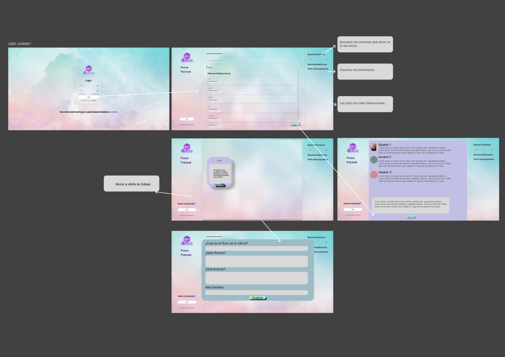
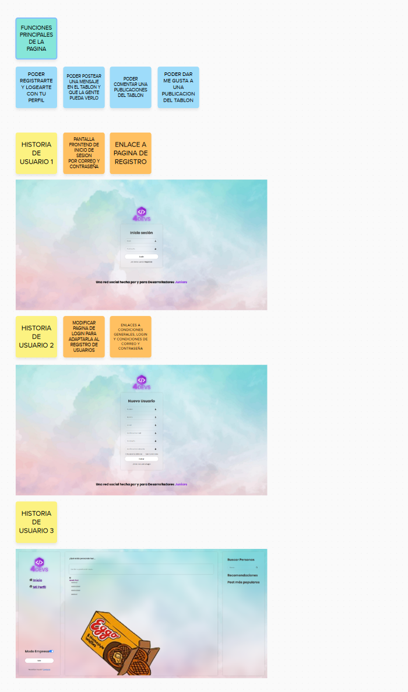

# 4Devs
## Red Social creada por y para desarrolladores.


### Cómo lanzar el proyecto 

- Para poder inicializar el proyecto necesitaremos un editor de codigo fuente, por ejemplo VS CODE:
https://code.visualstudio.com/download

- Necesitaremos instalar JAVA 17 para poder levantar el backend o tocar codigo: https://www.oracle.com/java/technologies/javase/jdk17-archive-downloads.html

#### Backend

Antes de lanzar el backend, necesitamos una base de datos postgres (ver `src/main/resources/application.properties`).
- Para la base de datos la tenemos a traves de PostgreSQL, puedes acceder a traves de este enlace:https://www.enterprisedb.com/downloads/postgres-postgresql-downloads
- Puedes usar docker.

```
cd backend
mvn spring-boot:run
```
- Si nos sale un error de JAVA_HOME es por el tema de las variables de entorno, os dejo una pequeña guia para poder realizarlo sin problema justo aqui de bajo.

```
Edita las variables de entorno:

    Windows:
        Busca "Sistema" en el menú Inicio y selecciona "Propiedades del sistema".
        Haz clic en "Configuración avanzada del sistema".
        En la pestaña "Opciones avanzadas", haz clic en "Variables de entorno".
        En la sección "Variables del sistema", busca la variable "JAVA_HOME". Si no existe, crea una nueva.
        Edita el valor de "JAVA_HOME" para que apunte a la ruta de la carpeta de instalación de Java (por ejemplo, C:\Program Files\Java\jdk-19).
        Crea una nueva variable de entorno llamada "PATH" si no existe.
        Agrega al final del valor de "PATH" la siguiente línea: ;%JAVA_HOME%\bin.
    macOS:
        Abre "Preferencias del sistema".
        Selecciona "Perfil".
        Haz clic en "Avanzado".
        Haz clic en el botón "+".
        En el campo "Nombre", escribe "JAVA_HOME".
        En el campo "Valor", escribe la ruta de la carpeta de instalación de Java (por ejemplo, /Library/Java/JavaVirtualMachines/jdk19.jdk/Contents/Home).
        Haz clic en el botón "+".
        En el campo "Nombre", escribe "PATH".
        En el campo "Valor", escribe export PATH=$PATH:$JAVA_HOME/bin.
        Cierra la ventana de "Preferencias del sistema".
```
#### Frontend

```
npm install 
npm run dev

para lanzar los tests del front usaremos 
"npm test" desde el directorio local.
```


# 👩‍👩‍👧‍👧4DEVs - Red Social para desarrolladores Junior.👩‍👩‍👧‍👧

Nuestra misión:

    - Conseguir crear una red social centrada en la ayuda, el compañerismo y las buenas practicas.
    - Que las empresas tenga a mano una bolsa de trabajadores dispuestos a darlo todo y con ganas.
    - Conseguir hacer de la ayuda un juego, donde cada granito de arena que aportes te ayude a encontrar mejores puestos de trabajo.

¿Qué puedes encontrar en *4devs*?

    Una comunidad sana, dispuesta a darlo todo por mejorar, ayudar y fomentar el aprendizaje en grupo.

#  Descripción del proyecto
    Version 1.0 


🛠️ Las funcionalidades básicas que cubre la aplicación web son las siguientes:
- Poder registrarte como Usuario y quedar registrado en la base de datos.
- Con un Correo y Password una authentificion de seguridad basica.
- Poder subir un post con un texto y una imagen.
- Poder ver los post que han sido subidos anteriormente en un feed.


    Version 2.0 ( Pendiente de desarollo )

- Poder entrar con mas de una cuenta con roles de usuario.
- Registrar quien ha subido cada post.
- Poder ver todos los post de la gente.
- Poder usar el buscador para ver diferentes tipos de usuario.
- Poder dar me gusta a la publicacion y un contador que sume todas de cada usuario.

## Tecnologías utilizadas


 

## Repositorio publico para poder ver, o proponer mejoras.

https://github.com/FactoriaF5Code/rc2-final-project-OliCasiano

## Figma primer diseño:



## User Journey version 1.0

